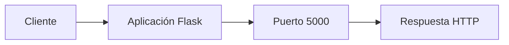

# Simple Web Application

A minimal [Python Flask](https://flask.palletsprojects.com/) web application used as the demo app in the [KodeKloud Docker for Beginners](https://kodekloud.com/courses/docker-for-the-absolute-beginner-hands-on/) course.

The app exposes two routes:

| Route | Response |
|---|---|
| `/` | `Welcome!` |
| `/how-are-you` | `I am good, how about you?` |

## Run manually (without Docker)

These steps assume a fresh machine.

1. Select an OS - Ubuntu

2. Update the package index:

   ```bash
   sudo apt-get update
   ```

3. Install Flask (this also pulls in Python 3):

   ```bash
   sudo apt-get install -y python3-flask
   ```

4. Set the Flask app environment variable:

   ```bash
   export FLASK_APP=app.py
   ```

5. Start the application:

   ```bash
   flask run --host=0.0.0.0
   ```

Then open `http://localhost:5000` and `http://localhost:5000/how-are-you` in a browser.

## Run with Docker

```bash
git clone https://github.com/mmumshad/simple-webapp-flask.git
cd simple-webapp-flask
docker build -t simple-webapp-flask .
docker run -p 5000:5000 simple-webapp-flask
```

Then open `http://localhost:5000` and `http://localhost:5000/how-are-you` in a browser.

## The Dockerfile

```dockerfile
FROM ubuntu

RUN apt-get update
RUN apt-get install -y python3-flask

COPY app.py /opt/app.py

ENV FLASK_APP=/opt/app.py

ENTRYPOINT ["flask", "run", "--host=0.0.0.0"]
```

Each instruction mirrors one of the manual steps above — making it easy to see how a Dockerfile is just an automated install script.


# Student Contribution

## Developer Information

- Name: Pedro Uriel Perez Monzon
- University: Universidad Tecnológica del Norte de Guanajuato
- Date: 2025

## Proposed Improvements

1. Mejorar la documentación de instalación
2. Agregar ejemplos de uso de la aplicación
3. Incluir instrucciones para despliegue en la nube

## Observations

Esta aplicación es un ejemplo sencillo de una aplicación web con Flask. Es ideal para aprender conceptos básicos de desarrollo web con Python.

## Project Strengths

1. Código simple y fácil de entender
2. Uso de Flask, un framework ligero y popular
3. Incluye archivo Dockerfile para despliegue
4. Documentación clara y concisa
5. Ideal para entornos de aprendizaje

## Improvement Opportunities

1. Agregar pruebas unitarias
2. Implementar autenticación de usuarios
3. Mejorar el diseño de la interfaz
4. Agregar base de datos
5. Implementar CI/CD pipeline

## Technologies Used

| Tecnología | Versión | Uso |
|-----------|---------|-----|
| Python | 3.x | Backend |
| Flask | Latest | Framework web |
| Docker | Latest | Contenedorización |
| GitHub | - | Control de versiones |

## Architecture Diagram



## Functional Requirements

- RF-01 El sistema deberá mostrar una página de bienvenida.
- RF-02 El sistema deberá responder en el puerto 5000.
- RF-03 El sistema deberá ejecutarse en un contenedor Docker.
- RF-04 El sistema deberá manejar rutas HTTP básicas.
- RF-05 El sistema deberá retornar respuestas en formato HTML.
- RF-06 El sistema deberá soportar múltiples rutas.
- RF-07 El sistema deberá ser desplegable en cualquier sistema operativo.
- RF-08 El sistema deberá tener un tiempo de respuesta menor a 1 segundo.
- RF-09 El sistema deberá incluir manejo básico de errores.
- RF-10 El sistema deberá ser escalable mediante contenedores.

# Práctica 03: Fork y Pull Request

## Nombre del estudiante
Pedro Uriel Perez Monzon

## Repositorio trabajado
[mmumshad/simple-webapp-flask](https://github.com/mmumshad/simple-webapp-flask)

## Mi Fork
[Pedro-Uriel-Perez/simple-webapp-flask](https://github.com/Pedro-Uriel-Perez/simple-webapp-flask)

## Evidencia 1 — Fork creado


## Evidencia 2 — git remote -v


## Evidencia 3 — git branch


## Evidencia 4 — git log --oneline


## Evidencia 5 — Pull Request creado


## Evidencia 6 — URL del Pull Request
[https://github.com/mmumshad/simple-webapp-flask/pull/75](https://github.com/mmumshad/simple-webapp-flask/pull/75)

## Comandos utilizados
- git clone
- git remote add
- git fetch
- git branch
- git checkout
- git status
- git add
- git commit
- git push
- git merge
- git log
